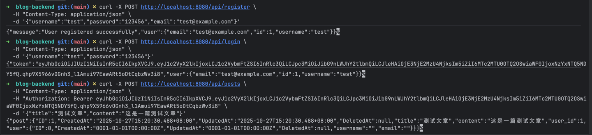

# 个人博客系统后端 #

## 测试说明

```
安装依赖
```
* go get github.com/gin-gonic/gin
* go get gorm.io/gorm
* go get gorm.io/driver/mysql
* go get github.com/golang-jwt/jwt/v5
* go get golang.org/x/crypto/bcrypt
* go get github.com/sirupsen/logrus

> 测试脚本在 `test/test.sh` 中，执行前请确保服务已启动。


